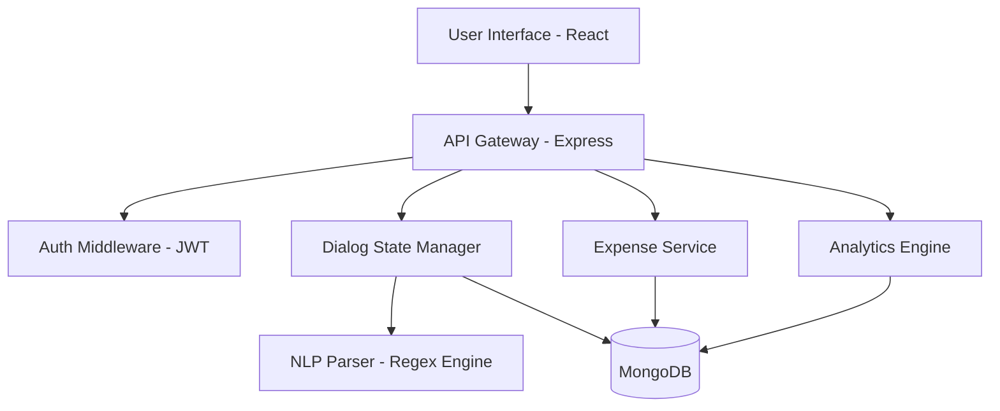

# Design Document: Precision Ledger AI (PS[3])

## 1. Executive Summary
**Precision Ledger AI** is a next-generation financial management tool that bridges the gap between conversational ease-of-use and rigorous accounting standards. By utilizing a session-aware AI agent built on the MERN stack, the application allows users to log, track, and analyze expenses through natural human dialogue.

---

## 2. System Architecture

The project follows a **Modular Monolith** architecture with a clear separation of concerns between the presentation layer (React), the logic engine (Node/Express), and the persistence layer (MongoDB).

### 2.1 High-Level Component Diagram


### 2.2 Core Logic: The Dialog State Machine
Unlike traditional form-based applications, the "brain" of this system is a **Session-Aware State Machine**. It maintains the context of a conversation dynamically, allowing for:
- **Interruption Handling:** Responding to FAQs mid-flow without losing expense data.
- **Backpressure Management:** Prompting precisely for missing fields.
- **Undo Capability:** Transaction-level rollback via voice/text commands.

---

## 3. Tool Choices & Rationales

| Tool | Rationale |
| :--- | :--- |
| **React + Vite** | Provides the reactivity needed for a real-time chat interface while maintaining a near-instant developer experience via ES modules. |
| **Vanilla CSS** | To meet the "Editorial Design" requirement, custom CSS was used to implement glassmorphism, precise grid typography, and vibrant gradients without the constraints of a utility framework. |
| **Node.js (Express)** | Non-blocking I/O is ideal for a chat application where multiple socket-like REST requests are fired in rapid succession. |
| **MongoDB** | The document structure allows us to store "Draft Entities" in the user session as JSON objects, which perfectly maps to the final persistent record. |
| **Chart.js** | Used for the Analytics Dashboard to provide high-performance, interactive data visualizations for monthly trends and category spend. |

---

## 4. Technical Implementation: NLP & NLU

### 4.1 Entity Extraction Strategy
The system uses a **Greedy Regex Pipeline**. Instead of relying on expensive external LLMs, we developed custom heuristics that can process:
- **Co-referencing:** Identifying multiple fields in one sentence (e.g., *"Spent 500 on Food today"*).
- **Entity Amendment:** Retroactively changing a field value (e.g., *"Actually, change the amount to 450"*).

### 4.2 Data Validation Protocol
Validation happens at three layers:
1. **Frontend:** Real-time UI validation (Inline Field Errors).
2. **Controller:** Pre-save logic checks in the `chat.js` controller.
3. **Database:** Mongoose Schema constraints (Enums for categories, strict formats for phone/email).

---

## 5. API Schema Definition

### 5.1 Expense Model
```javascript
{
  shortId: { type: String, unique: true }, // For user-friendly reference
  fullName: { type: String, required: true }, // Format: "First Last"
  email: { type: String, required: true }, // Valid format
  contactNumber: { type: String, required: true }, // "+XX XXXXXXXXXX"
  amount: { type: Number, required: true }, // > 0
  category: { type: String, enum: ['Transport', 'Shopping', 'Food'] },
  cardType: { type: String, enum: ['Debit Card', 'Credit Card'] },
  date: { type: String, required: true }, // DD-MM-YYYY
  description: { type: String, required: true }
}
```

---

## 6. Project Roadmap & Future Improvements
- **Encryption:** Implement field-level encryption for PII (Names/Phones) at rest.
- **LLM Integration:** Pivot to a small local model (like Llama-3-8B) for more complex natural language understanding while maintaining privacy.
- **Push Notifications:** Integrate Budget threshold alerts via Web Push API for proactive monitoring.
