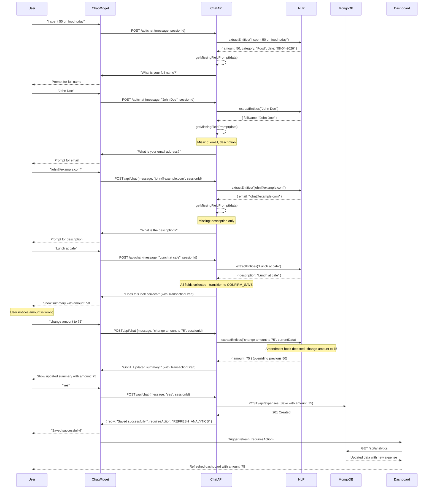
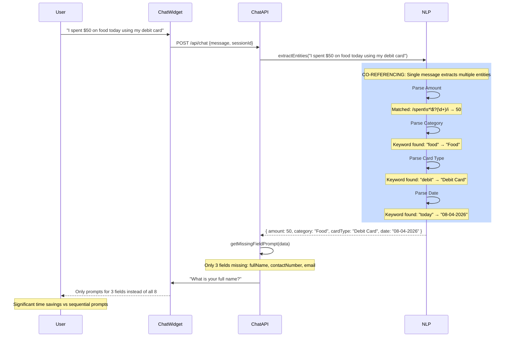
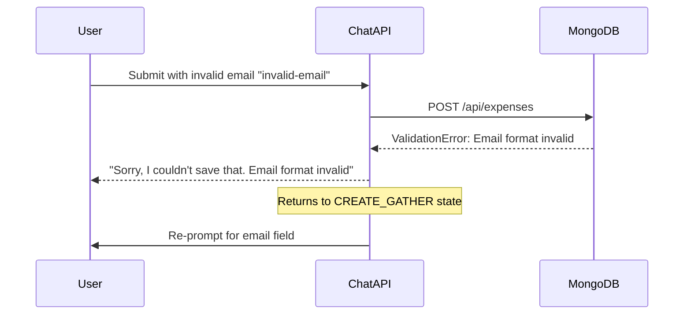
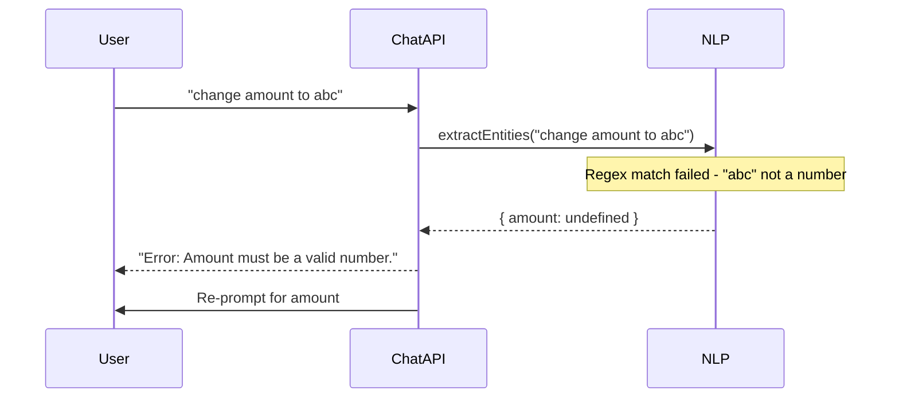

# Agent Dialog and API Integration Flow

## Overview

This document provides a comprehensive flow diagram showing the complete interaction between the user, frontend chat widget, backend API, NLP parser, and MongoDB database.

---

## 1. Complete System Flow Diagram

```
┌─────────────────────────────────────────────────────────────────────────────────────────┐
│                                      USER                                               │
│                           (Natural Language Input)                                        │
└─────────────────────────────────┬───────────────────────────────────────────────────────┘
                                  │
                                  ▼
┌─────────────────────────────────────────────────────────────────────────────────────────┐
│                              CHAT WIDGET (Frontend)                                       │
│  ┌─────────────────────────────────────────────────────────────────────────────────┐   │
│  │                                                                                   │   │
│  │   1. User types message or uses voice input                                        │   │
│  │   2. Message appended to chat history                                              │   │
│  │   3. POST /api/chat with { sessionId, message }                                   │   │
│  │   4. Receive response { reply, state, requiresAction }                             │   │
│  │   5. Render reply with TransactionDraft component if applicable                     │   │
│  │   6. Execute requiresAction if present (REFRESH_ANALYTICS, LOAD_MODIFY, etc.)    │   │
│  │                                                                                   │   │
│  └─────────────────────────────────────────────────────────────────────────────────┘   │
└─────────────────────────────────┬───────────────────────────────────────────────────────┘
                                  │
                    POST /api/chat { sessionId, message }
                                  │
                                  ▼
┌─────────────────────────────────────────────────────────────────────────────────────────┐
│                            CHAT API ROUTE (/api/chat)                                     │
│  ┌─────────────────────────────────────────────────────────────────────────────────┐   │
│  │                                                                                   │   │
│  │   ┌─────────────────────────────────────────────────────────────────────────┐   │   │
│  │   │                     STATE MACHINE                                         │   │   │
│  │   │                                                                          │   │   │
│  │   │    ┌─────────┐     ┌────────────────┐     ┌─────────────────┐            │   │   │
│  │   │    │  MENU   │────▶│ CREATE_GATHER  │────▶│  CONFIRM_SAVE   │            │   │   │
│  │   │    └────┬────┘     └────────────────┘     └────────┬────────┘            │   │   │
│  │   │         │                                         │                      │   │   │
│  │   │         │              ┌───────────────────────────┘                      │   │   │
│  │   │         │              │                                                   │   │   │
│  │   │         │              ▼                                                   │   │   │
│  │   │    ┌────┴────┐     ┌────────────────┐     ┌─────────────────┐            │   │   │
│  │   │    │ VIEW_    │────▶│   MENU         │◀────│  MODIFY_CONFIRM │            │   │   │
│  │   │    │ ASK_MOBI │     │ (Show Results) │     └─────────────────┘            │   │   │
│  │   │    └──────────┘     └────────────────┘                                   │   │   │
│  │   │         │                                                               │   │   │
│  │   │         │     ┌────────────────┐     ┌─────────────────┐                │   │   │
│  │   │         └────▶│   MODIFY_       │────▶│  MODIFY_ACTION  │                │   │   │
│  │   │               │   ASK_MOBILE   │     └─────────────────┘                │   │   │
│  │   │               └────────────────┘                                        │   │   │
│  │   │                                                                          │   │   │
│  │   └─────────────────────────────────────────────────────────────────────────┘   │   │
│  │                                                                                   │   │
│  └─────────────────────────────────────────────────────────────────────────────────┘   │
└─────────────────────────────────┬───────────────────────────────────────────────────────┘
                                  │
                                  ▼
┌─────────────────────────────────────────────────────────────────────────────────────────┐
│                          ENTITY EXTRACTION (extractEntities)                              │
│  ┌─────────────────────────────────────────────────────────────────────────────────┐   │
│  │                                                                                   │   │
│  │   Step 1: Check Amendment Hooks (override existing values)                        │   │
│  │           - "change amount to XYZ"                                               │   │
│  │           - "change category to ABC"                                              │   │
│  │           - "change date to DD-MM-YYYY"                                          │   │
│  │                                                                                   │   │
│  │   Step 2: Parse Amount                                                            │   │
│  │           Regex: /spent\s*(?:rs\.?|inr|\$|€|£)?\s*(\d+(\.\d{1,2})?)/i            │   │
│  │                                                                                   │   │
│  │   Step 3: Parse Category                                                         │   │
│  │           Keywords: "food", "transport", "shopping"                               │   │
│  │                                                                                   │   │
│  │   Step 4: Parse Card Type                                                        │   │
│  │           Keywords: "debit", "credit"                                            │   │
│  │                                                                                   │   │
│  │   Step 5: Parse Date                                                             │   │
│  │           Format: DD-MM-YYYY or keyword "today"                                  │   │
│  │                                                                                   │   │
│  │   Step 6: Parse Contact Number                                                   │   │
│  │           Regex: /(\+\d{1,4}\s?\d{10})/                                          │   │
│  │                                                                                   │   │
│  │   Step 7: Parse Email                                                            │   │
│  │           Regex: /([\w.-]+@[\w.-]+\.\w+)/                                        │   │
│  │                                                                                   │   │
│  │   Step 8: Parse Full Name                                                        │   │
│  │           Pattern: "my name is X Y" or two-word response                         │   │
│  │                                                                                   │   │
│  │   Step 9: Parse Description                                                       │   │
│  │           Pattern: "for XYZ"                                                     │   │
│  │                                                                                   │   │
│  └─────────────────────────────────────────────────────────────────────────────────┘   │
└─────────────────────────────────┬───────────────────────────────────────────────────────┘
                                  │
                                  ▼
┌─────────────────────────────────────────────────────────────────────────────────────────┐
│                          MONGODB DATABASE (expense_tracker)                               │
│  ┌─────────────────────────────────────────────────────────────────────────────────┐   │
│  │                                                                                   │   │
│  │   Collection: expenses                                                             │   │
│  │   ┌─────────────────────────────────────────────────────────────────────────┐   │   │
│  │   │  {                                                                      }   │   │
│  │   │    _id: ObjectId,                                                          │   │   │
│  │   │    shortId: "ABC123",                                                     │   │   │
│  │   │    fullName: "John Doe",                                                 │   │   │
│  │   │    cardType: "Debit Card",                                               │   │   │
│  │   │    category: "Food",                                                      │   │   │
│  │   │    amount: 50,                                                            │   │   │
│  │   │    description: "Lunch",                                                  │   │   │
│  │   │    date: "08-04-2026",                                                   │   │   │
│  │   │    contactNumber: "+1 2345678901",                                        │   │   │
│  │   │    email: "john@example.com",                                             │   │   │
│  │   │    createdAt: ISODate("2026-04-08T..."),                                  │   │   │
│  │   │    updatedAt: ISODate("2026-04-08T...")                                   │   │   │
│  │   │  {                                                                      }   │   │
│  │   └─────────────────────────────────────────────────────────────────────────┘   │   │
│  │                                                                                   │   │
│  │   Collection: budgets                                                            │   │
│  │   ┌─────────────────────────────────────────────────────────────────────────┐   │   │
│  │   │  { mobile: "+1 2345678901", category: "Food", threshold: 5000 }       │   │   │
│  │   └─────────────────────────────────────────────────────────────────────────┘   │   │
│  │                                                                                   │   │
│  └─────────────────────────────────────────────────────────────────────────────────┘   │
└─────────────────────────────────────────────────────────────────────────────────────────┘
```

---

## 2. Sequence Diagram: Entity Amendment Flow



---

## 3. Sequence Diagram: Co-referencing Flow



---

## 4. State Transition Table

| Current State | User Input | Next State | Side Effects |
|---------------|------------|------------|--------------|
| MENU | "1", "create", expense intent | CREATE_GATHER | Start entity collection |
| MENU | "2", "view" | VIEW_ASK_MOBILE | Prompt for contact number |
| MENU | "3", "modify" | MODIFY_ASK_MOBILE | Prompt for contact number |
| MENU | "undo" | MENU | Delete last saved expense |
| MENU | "set budget" | BUDGET_ASK_MOBILE | Prompt for contact number |
| CREATE_GATHER | Any valid entity | CREATE_GATHER | Update session data, prompt next missing |
| CREATE_GATHER | All fields collected | CONFIRM_SAVE | Show transaction summary |
| CONFIRM_SAVE | "yes" | MENU | Save to MongoDB, set lastSavedId |
| CONFIRM_SAVE | Any correction | CONFIRM_SAVE | Update session data, re-show summary |
| VIEW_ASK_MOBILE | Valid phone | MENU | Display recent expenses |
| VIEW_ASK_MOBILE | Invalid phone | VIEW_ASK_MOBILE | Show error, re-prompt |
| MODIFY_ASK_MOBILE | Valid phone | MODIFY_ACTION | Load expenses for user |
| MODIFY_ASK_MOBILE | Invalid phone | MODIFY_ASK_MOBILE | Show error, re-prompt |
| MODIFY_ACTION | "delete ID" | MODIFY_CONFIRM | Prepare to delete |
| MODIFY_ACTION | "change date" | MODIFY_CONFIRM | Prepare to update |
| MODIFY_ACTION | "cancel" | MENU | Cancel operation |
| MODIFY_CONFIRM | "yes" | MENU | Execute delete/update |
| MODIFY_CONFIRM | Any other | MENU | Cancel operation |
| BUDGET_ASK_MOBILE | Valid phone | MENU | Save budget threshold |

---

## 5. Error Handling Flows

### Validation Error (Create)



### Amendment Invalid Input



---

## 6. FAQ Detection Flow

```mermaid
flowchart TD
    A[User Message] --> B{Short numeric input?}
    B -->|Yes| C[Ignore - Menu selection]
    B -->|No| D{Keyword match?}
    
    D -->|purpose| E[Return purpose response]
    D -->|categories| F[Return categories response]
    D -->|security| G[Return security response]
    D -->|export| H[Return export response]
    D -->|track| I[Return tracking help]
    D -->|delete| J[Return modify/delete help]
    D -->|No match| K[Continue to State Machine]
    
    E --> L[Return FAQ Response]
    F --> L
    G --> L
    H --> L
    I --> L
    J --> L
    K --> M[Process via State Machine]
``